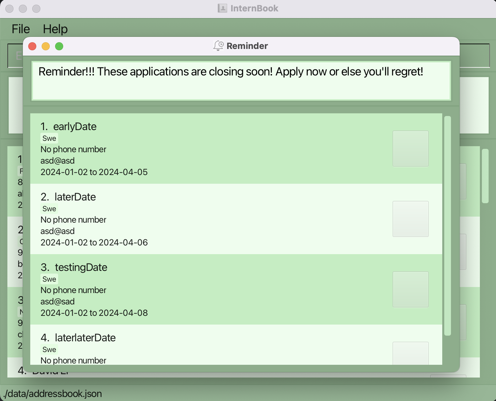

# InternBook User Guide

Welcome to InternBook!

InternBook is your go-to fast, reliable and customizable **desktop app for tracking internship details**

It is optimized for a _Command Line Interface_ (CLI), but you can still use the advantages of a _Graphical User Interface_ (GUI).

<!-- * Table of Contents -->
<page-nav-print />

--------------------------------------------------------------------------------------------------------------------

## Getting Started!

> [!IMPORTANT]
> Ensure you have Java `11`  installed in your computer. If you do not have it installed, download it from [here.](https://www.oracle.com/sg/java/technologies/javase/jdk11-archive-downloads.html)
1. Download the latest `internbook.jar` from [here](https://github.com/se-edu/addressbook-level3/releases).

2. Copy the file to the folder you want to use as the _home folder_ for your Internbook.

3. Open a command terminal, `cd` into the folder you put the jar file in, and use the `java -jar internbook.jar` command to run the application.
> [!TIP]
> If you are struggling to figure out the path to `cd` into, you can use the File Explorer in your OS to copy the file path and directly `cd` to that.  

  A GUI similar to the one displayed below should appear in a few seconds. Note how the app already contains some sample data.  
     

4. Try out a command!  
   For instance, typing **`help`** and pressing Enter will open the help window. 
 You can also try out the following commands:

   * `list` : Lists all contacts.

   * `add -n Company -e company@gmail.com -t Role`: Adds a company contact with name ``Company``, email ``company@gmail.com`` and tag ``Role``.

   * `delete 1` : Deletes the contact with index ``1``.

   * `exit` : Exits the app.  

5. Refer to the [Features](#features) below for details of each command.

--------------------------------------------------------------------------------------------------------------------

## Features

<box type="info" seamless>

**Notes about the command format:** 

* Words in `UPPER_CASE` are the parameters to be supplied by the user. 
  e.g. in `add -n COMPANY`, `COMPANY` is a parameter which can be used as `add -n DBS`.

* Items in square brackets are optional. 
  e.g `-n COMPANY [-p PHONE_NUMBER]` can be used as `-n DBS -p 61234567` or as `-n DBS`.

* Items with `…`​ after them can be used multiple times. 
  e.g. `-t TAG…​` can be used as `-t Software Engineer`, `-t Software Engineer -t Data Analyst` etc.

* Parameters can be in any order. 
  e.g. if the command specifies `-n COMPANY -t Software Engineer`, `-t Software Engineer -n COMPANY` is also acceptable.

* Extraneous parameters for commands that do not take in parameters (such as `help`, `list`, `exit` and `clear`) will be ignored. 
  e.g. if the command specifies `help 123`, it will be interpreted as `help`.

* If you are using a PDF version of this document, be careful when copying and pasting commands that span multiple lines as space characters surrounding line-breaks may be omitted when copied over to the application.
</box>

### Viewing help : `help`

Shows a message explaning how to access the help page.

Format: `help`

### Adding a company: `add`

Adds a company to the address book.

Format: `add -n COMPANY -e EMAIL -t TAG…​ [-p PHONE_NUMBER] [-d1 START_DATE] [-d2 END_DATE]`

<box type="tip" seamless>

**Tip:** A company can have a phone number (optional), start date (optional), end date (optional) and multiple tags.
</box>

Examples:
* `add -n DBS -t Software Engineer -e dbs@example.com -d1 2024-04-04 -d2 2024-05-05`
* `add -n Tiktok -t Data Analyst -e tiktok@example.com -p 61234567 -t AI Engineer`

### Listing all companies : `list`

Shows a list of all companies in the address book.

Format: `list`

### Editing a company : `edit`

Edits an existing company in the address book.

Format: `edit INDEX [-n NAME] [-p PHONE] [-e EMAIL] [-t TAG] [-d1 START_DATE] [-d2 END_DATE}…​`

* Edits the company at the specified `INDEX`. The index refers to the index number shown in the displayed company list. The index **must be a positive integer** 1, 2, 3, …​
* At least one of the optional fields must be provided.
* Existing values will be updated to the input values.
* When editing tags, the existing tags of the company will be removed i.e adding of tags is not cumulative.
* You can remove all the company’s tags by typing `-t` without
    specifying any tags after it.

Examples:
*  `edit 1 -p 91234567 -e dbs_hr@example.com` Edits the phone number and email address of the 1st company to be `91234567` and `dbs_hr@example.com` respectively.
*  `edit 2 -n Meta -t` Edits the name of the 2nd company to be `Meta` and clears all existing tags.

### Locating companies by name: `find`

Finds companies whose names or tags contain the given keyword.

Format: `find KEYWORD`

* The search is case-insensitive. e.g `Google` will match `google`
* The order of the keywords matters. e.g. `Software Engineer` will not match `Engineer Software`
* Only the name and tags are searched.
* Only words beginning with the keyword will be matched e.g. `ware` will not match `software`
* Companies matching all keywords will be returned (i.e. `AND` search).
  e.g. `Google` will only return `Google` or `google`.

Examples:
* `find Google` returns `google` and `Google`
* `find software` returns `Software Company` and companies with tags matching `software`  
  

### Deleting a company : `delete`

Deletes the specified company from the address book.

Format: `delete INDEX`

* Deletes the company at the specified `INDEX`.
* The index refers to the index number shown in the displayed company list.
* The index **must be a positive integer** 1, 2, 3, …​

Examples:
* `list` followed by `delete 2` deletes the 2nd company in the intern book.
* `find Google` followed by `delete 1` deletes the 1st company in the results of the `find` command.

### Clearing all entries : `clear`

Clears all entries from the intern book.

Format: `clear`

### Exiting the program : `exit`

Exits the program.

Format: `exit`

### Saving the data

InternBook data are saved in the hard disk automatically after any command that changes the data. There is no need to save manually.

### Editing the data file

InternBook data are saved automatically as a JSON file `[JAR file location]/data/addressbook.json`. Advanced users are welcome to update data directly by editing that data file.

<box type="warning" seamless>

**Caution:**
If your changes to the data file makes its format invalid, InternBook will discard all data and start with an empty data file at the next run.  Hence, it is recommended to take a backup of the file before editing it. 
Furthermore, certain edits can cause the AddressBook to behave in unexpected ways (e.g., if a value entered is outside the acceptable range). Therefore, edit the data file only if you are confident that you can update it correctly.
</box>

### Marking a company : `mark`

Marks the specified company as applied.

Format: `mark INDEX`

* Marks the company at the specified `INDEX` as applied.
* The index refers to the index number shown in the displayed company list.
* The index **must be a positive integer** 1, 2, 3, …​

### Marking a company : `unmark`

Marks the specified company as not applied.

Format: `unmark INDEX`

* Marks the company at the specified `INDEX` as not applied.
* The index refers to the index number shown in the displayed company list.
* The index **must be a positive integer** 1, 2, 3, …​

### Sorting the list : `sort`

Sorts the list in specific order.

Format: `sort PREF`

* Sorts the company with the given `PREF`.
* `PREF` refers to the preference the user can choose from.
* There is currently 3 preference:
    * a - sorts list in ascending alphabetical order of company name
    * s - sorts list in ascending order of application start date
    * e - sorts list in ascending order of application end date

Examples:
* `sort a`
* `sort s`
* `sort e`

### Setting reminders : `setReminder`

Set the number of days until the end date of an application and receive reminders about approaching deadlines. 
A reminder window will pop up the next time you launch the app. Companies, whose end date is `NUMOFDAYS` away from current
date, and you have yet to apply, will show up.

Format: `setReminder -r NUMOFDAYS`
* Save your preference into `preferences.json` file 

**Tip:** You can switch off reminders by typing `setReminder -r off`.
* The off is case-insensitive. e.g `setReminder -r OFF` works too.

Examples:
* `setReminder -r 7`

### Archiving data files `[coming in v2.0]`

_Details coming soon ..._

--------------------------------------------------------------------------------------------------------------------

## FAQ

**Q**: How do I transfer my data to another Computer? 
**A**: Install the app in the other computer and overwrite the empty data file it creates with the file that contains the data of your previous AddressBook home folder.

**Q**: How do I check if I am on JDK 11? 
**A**: For MAC users, open up your **Terminal**, and for Windows users, open up your **Command Prompt**.
Type in `java -version` and you will see the java version.

--------------------------------------------------------------------------------------------------------------------

## Known issues

1. **When using multiple screens**, if you move the application to a secondary screen, and later switch to using only the primary screen, the GUI will open off-screen. The remedy is to delete the `preferences.json` file created by the application before running the application again.

--------------------------------------------------------------------------------------------------------------------

## Command summary

| Action       | Format, Examples                                                                                                                                      |
|--------------|-------------------------------------------------------------------------------------------------------------------------------------------------------|
| **Add**      | `add -n NAME [-p PHONE_NUMBER] -e EMAIL [-d1 START_DATE] [-d2 END_DATE] -t TAG…​`   e.g., `add -n Meta -e meta@example.com  -t Software Developer` |
| **Clear**    | `clear`                                                                                                                                               |
| **Sort**     | `sort PREF`  e.g., `sort a`                                                                                                                        |
| **Delete**   | `delete INDEX`  e.g., `delete 3`                                                                                                                   |
| **Edit**     | `edit INDEX [-n NAME] [-p PHONE_NUMBER] [-e EMAIL] [-d1 START_DATE] [-d2 END_DATE] [-t TAG]…​`  e.g.,`edit 2 -n DBS -p 91234567`                   |
| **Find**     | `find KEYWORD `  e.g., `find Google`                                                                                                               |
| **Reminder** | `setReminder -r NUMOFDAYS`   e.g., `setReminder -r 7`                                                                                              |
| **Mark**     | `mark INDEX`  e.g., `mark 1`                                                                                                                       |
| **Unmark**   | `unmark INDEX`  e.g, `unmark 3`                                                                                                                    |
| **List**     | `list`                                                                                                                                                |
| **Help**     | `help`                                                                                                                                                |
